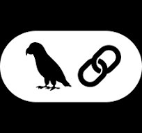

# 
Hi there! I'm Yuming

### 
💻 Full Stack & AI Developer 💻

### 
👨‍⚖️ Life Long Learner 👨‍⚖️

- 🌱 I'm currently working from home.

- 🔭 I am currently learning Blockchain Technology.

- ⚡ Fun fact: AI growth will replace a lot of coding.
   

## 💪 My Skill Set

<table><tr><td valign="top" width="33%">

### Programming Languages

  
  
  
  
  

### Backend Development

  
  
  
 
  
   

### AI Development

  
    
    
    
    
    
    

</td><td valign="top" width="33%">

### Database Management

  
  
  
  
  
  

### Frontend Development

  
  
  
  
  
  
  

### DevOps Engineering Skills

  
  
  
  
  
  
  

</td></tr></table>

 

## 🤝 Support

🎀 Contributions (<a href="https://guides.github.com/introduction/flow" title="GitHub flow">GitHub Flow</a>), 🔥 issues, and 🥮 feature requests are most welcome!

💙 If you like my projects, Give them ⭐ and Share it with friends!

 

Made by ❤️ Yuming

## 
⚡️<i>Stay awesome!</i>⚡️

